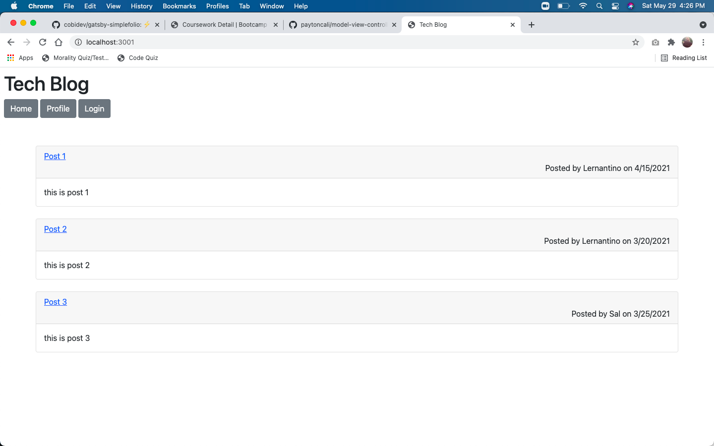

# Tech Blog

## Table of Contents
  
1. [Description](#description)
2. [Installation](#installation)
3. [Usage](#usage)
4. [Contributors](#contributors)
5. [Testing](#testing)

[License](#license)

### Description
This application allows users to have a webpage to post blogs, comment on others posts, delete the users posts and edit the users posts.
  
### Installation
1) npm i to install packages 2) Add the database using MYSQL 3) run node seeds/seed.js in their terminal
  
### Usage
This application will be used by tech professionals as a webpage to share blogs among the community
  
### Questions

If you have any question you can reach me by: 

GitHub: www.github.com/paytoncali

Email Address: paytoncaliw@gmail.com

### Deployment

https://frozen-stream-21398.herokuapp.com/
https://github.com/paytoncali/model-view-controller.git

### License
This application is covered by MIT

